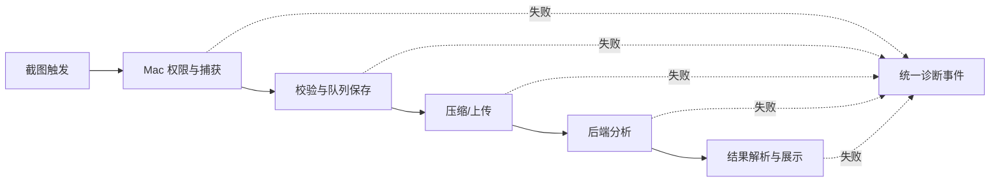
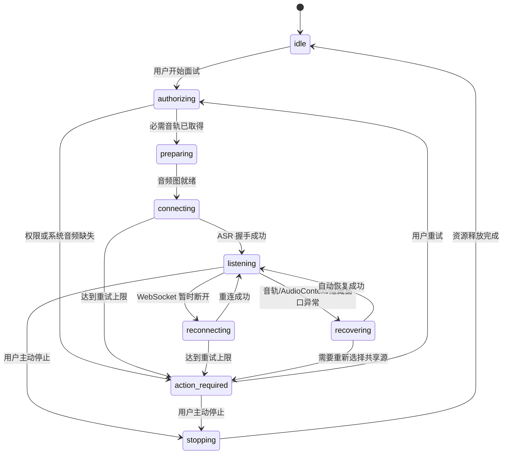

# Mac 截图与面试音频可靠性技术设计

## 1. 设计目标

本设计以“真实状态、可恢复、可复现”为核心，不再通过增加笼统提示或重复打包碰运气解决问题。修复集中在共享 `desktop-core`，Mac 壳只承担系统能力和构建差异；Gitee 是唯一代码基线，GitHub 仅在批准构建测试包时接收对应构建提交并运行 macOS runner。

安装器不能替用户写入 macOS TCC 授权。为满足安装后立即授权的产品要求，应用在全新安装后的第一次启动、进入工作台之前运行权限向导：主动请求麦克风、触发屏幕录制检测，并在用户明确操作后完成系统音频共享测试。权限向导只保存“已完成引导/已实测”的本地状态，真实权限始终以 macOS 查询和实时轨道结果为准。

设计覆盖两条链路：





## 2. 当前缺陷与设计对应关系

### 2.1 截图链路

当前 `ProcessingHelper` 已能生成部分 `code/stage` 并写入 `exam-analysis.log`，但存在以下缺口：

- 捕获、队列保存和压缩阶段没有共用同一个分析操作标识。
- 部分错误仍由调用方转换成 `processing-no-screenshots` 或 `UNKNOWN`，阶段语义丢失。
- 界面标题固定为“本次处理失败”，详细信息隐藏在内容区，没有复制诊断和打开日志入口。
- 日志仅覆盖 `analyze()`，无法还原截图捕获到请求完成的完整时间线。
- 实体 Mac 没有便捷的证据导出入口，导致无法判断用户遇到的是截图、上传、API、模型还是解析错误。

设计通过统一 `AnalysisOperation`、阶段化错误和诊断 IPC 解决，不预设用户这次失败一定来自某个后端错误。

### 2.2 面试音频链路

当前实现的高风险点为：

- `getDisplayMedia()` 成功后立即 `stop()` 视频轨。Mac 系统音频可能与显示捕获会话共生命周期，提前停止承载轨道可能使系统音频随后结束。
- 未监听系统音频/麦克风轨的 `ended`、`mute`、`unmute`，无法知道共享被系统或用户终止。
- 未监听 `AudioContext.statechange`，隐藏窗口被 macOS 中断或挂起后不会恢复。
- 主进程只有布尔 `running`，它表示“启动调用完成”，不代表音轨、处理器和 WebSocket 均健康。
- WebSocket 能重连，但 UI 不知道正在重连；重连持续失败也没有明确上限和“需要操作”状态。
- 主进程轮询 `executeJavaScript` 失败被吞掉，隐藏窗口崩溃时会保持虚假的运行状态。
- React 页面直接执行 `setListening(true/false)`，可能与后台真实状态产生分叉。

设计引入会话意图、运行健康状态和 generation 隔离，分别管理“用户希望继续运行”与“当前传输是否健康”。

## 3. 模块与职责

### 3.1 新增共享类型

在 `desktop-core/shared` 新增可靠性类型模块，包含：

```ts
type AnalysisStage =
  | 'capture-permission'
  | 'capture'
  | 'validate-image'
  | 'save-queue'
  | 'compress'
  | 'upload-ticket'
  | 'upload'
  | 'analyze-request'
  | 'parse-result'
  | 'complete';

type VoiceSessionPhase =
  | 'idle'
  | 'authorizing'
  | 'preparing'
  | 'connecting'
  | 'listening'
  | 'reconnecting'
  | 'recovering'
  | 'action-required'
  | 'stopping';

type ComponentHealth = 'unavailable' | 'starting' | 'healthy' | 'degraded' | 'recovering' | 'failed';

interface VoiceHealthSnapshot {
  sessionId: string;
  generation: number;
  desiredRunning: boolean;
  phase: VoiceSessionPhase;
  systemAudio: ComponentHealth;
  microphone: ComponentHealth;
  audioGraph: ComponentHealth;
  asrSocket: ComponentHealth;
  reconnectAttempt: number;
  lastAudioFrameAt?: number;
  lastSystemAudioLevel?: number;
  lastMicrophoneLevel?: number;
  code?: string;
  message?: string;
  action?: 'retry' | 'reselect-source' | 'open-settings' | 'none';
}
```

所有 Electron 边界负载以 `unknown` 接收并通过类型守卫收窄，不新增 `any` 逃逸。

### 3.2 `ScreenshotHelper`

职责调整：

- 每次捕获接收 `operationId`，按阶段返回结构化 `ScreenshotResult`。
- 权限、空缩略图、黑屏/异常尺寸、系统回退失败使用稳定错误码。
- `fileToCompressedBase64` 不再静默回退后假装成功；返回压缩方式、输入/输出大小与明确失败。
- Mac 原生捕获和 `screencapture` 回退分别写阶段证据，最终只暴露一个根因。
- 保持失败不占用截图频率限制窗口。
- 自身题目截图沿用主进程的悬浮框临时隐藏/恢复机制，并增加捕获前后状态确认；该机制仅保证 QuizMate 自身截图输入不包含悬浮框，不对系统截图、第三方录屏或投屏提供捕获规避。

建议错误码示例：

| 阶段 | 错误码 | 用户动作 |
|---|---|---|
| 权限 | `MAC_SCREEN_PERMISSION_DENIED` | 打开屏幕录制设置并重启应用 |
| 捕获 | `MAC_CAPTURE_EMPTY_FRAME` | 检查权限/显示器后重试 |
| 保存 | `SCREENSHOT_QUEUE_WRITE_FAILED` | 检查磁盘空间后重试 |
| 压缩 | `SCREENSHOT_ENCODE_FAILED` | 重新截图 |

### 3.3 `ProcessingHelper`

职责调整：

- 引入 `AnalysisOperation`，包含 `operationId`、`requestId`、`attempt`、当前阶段和起止时间。
- 首次进入后端前生成稳定 `requestId`；网络超时且后端结果未知时，重试复用该 `requestId`，依赖后端幂等结算。
- 后端明确返回失败后，用户再次重试创建新 `requestId`，但保留同一个父 `operationId` 和递增 `attempt`。
- 将上传票据、PUT 上传、分析请求和结果解析错误统一转换为 `DiagnosticError`。
- 日志记录状态转换与耗时，不记录图片/Base64/令牌/签名 URL。
- 成功展示结果后由主编排清理对应截图；失败始终保留。

### 3.4 `RealtimeVoiceHelper` 主进程控制器

主进程成为会话状态的唯一事实来源：

- `desiredRunning` 表示用户意图，只有用户停止、应用退出或不可恢复错误确认后改变。
- `generation` 每次完整启动/重建递增，所有异步回调先比较 generation，旧会话事件不得影响新会话。
- `start()` 只有收到隐藏窗口 `listening` 健康快照后才成功。
- `stop()` 等待隐藏窗口完成资源释放并广播 `idle`，重复调用保持幂等。
- 监听 `render-process-gone`、`did-fail-load`、窗口销毁与轮询失败；当 `desiredRunning=true` 时重建隐藏窗口和采集会话一次，失败后进入 `action-required`。
- 定期拉取健康快照作为兜底，但状态变更优先由隐藏窗口主动上报，避免 200ms 轮询成为唯一机制。
- 通过 `interview:stateChanged` 广播完整快照给主页面和悬浮窗。

### 3.5 隐藏音频运行时

隐藏窗口内将现有自由变量收敛为单个 `VoiceRuntime`：

- 保存所有原始 `MediaStream` 与轨道，系统共享视频轨不立即停止；将其 `enabled=false` 且不接入音频图，仅在 teardown/rebuild 时统一停止。
- 分别登记 `systemAudioTrack`、`microphoneTrack` 和承载共享会话的显示轨，监听 `ended/mute/unmute`。
- 音频轨 `ended`：正式模式进入 `action-required/reselect-source`；演示模式的系统音频结束可降级为麦克风，麦克风结束则要求重新授权。
- 显示承载轨结束时视为系统共享结束，不再假装系统音频仍健康。
- 监听 `audioContext.statechange`；`suspended/interrupted` 时有限次数调用 `resume()`，失败则重建音频图。
- 用 `AnalyserNode` 或处理帧统计维护每个音源的轻量电平和 `lastAudioFrameAt`。长时间静音只标记“无音量”，不自动停止；只有轨道结束、上下文失败或无处理帧并伴随异常状态才触发恢复。
- `ScriptProcessorNode` 作为本次最小修复可保留，避免同时引入 AudioWorklet 迁移风险；后续可单独规格化迁移。
- teardown 必须移除监听器、断开节点、停止全部轨道、关闭上下文、清理 timer 和 WebSocket。

### 3.6 ASR WebSocket

- 独立 `socketGeneration`，每次建连递增；回调必须匹配当前 generation。
- 初次连接与重连复用同一个初始化函数，保证首包、WAV 头、序列号和模型参数一致。
- 非用户关闭进入 `reconnecting`，退避建议为 0.5s、1s、2s、4s、5s，最多 6 次。
- 重连成功清零计数并恢复 `listening`。
- 达到上限进入 `action-required/retry`，保持音轨一段受控时间等待用户重试，随后释放以避免长期占用系统共享。
- 记录关闭码、关闭原因的安全摘要和重连次数；不记录认证头。

### 3.7 `InterviewHelper`

- 不再维护独立的真值布尔 `listening`，而是从 `VoiceHealthSnapshot.desiredRunning/phase` 派生公开状态。
- 会话处于 `reconnecting/recovering` 时不取消待生成答案，也不递增答案 generation。
- 仅用户主动停止或完整会话终止时取消在途答案和清理 transcript。
- 音频模式切换走显式 `restart`，旧 generation 完整 teardown 后再启动新 generation。
- 手动输入问题不应被迫启动音频采集；它可直接提交文本，避免系统音频权限失败阻断手动兜底。

### 3.8 React 页面与悬浮窗

#### 面试页面

在“开始面试”控制区下方增加紧凑状态轨：

- 节点顺序：电脑声音 → 麦克风 → 音频处理 → 语音识别。
- 每个节点显示图标、短状态和最近活动指示；正式模式的麦克风节点显示“不使用”，不误报失败。
- `reconnecting/recovering` 使用青色活动态；降级为琥珀色；失败为玫红色并展开唯一主操作按钮。
- “开始面试”按钮状态完全由后台快照驱动，不在 IPC 返回后直接本地 `setListening(true)`。
- 提供“复制本次诊断”和“打开日志目录”，不新增独立设置页。

#### 首次启动权限向导

- 全新安装首次启动时，在工作台前显示三步向导：屏幕录制、麦克风、电脑声音实测。
- 每一步显示系统查询状态、操作按钮和实测结果；屏幕录制步骤以非空测试帧为通过，麦克风/电脑声音以活动轨和电平为通过。
- 系统音频需要用户选择共享源时，由按钮触发标准系统选择器；安装器和后台进程不尝试静默代授权。
- 用户可以暂时跳过，但工作台对应功能显示“尚未验证”，第一次使用时继续引导而不是突然弹出无上下文权限请求。
- 升级安装不重复打扰已经完成且权限仍有效的用户；权限被系统撤销后重新显示修复提示。

本次批准实现将旧三步按钮改为单一状态机入口：

1. DMG 替换完成后首次从 `/Applications` 启动，在创建任何窗口或捕获会话前检查全局迁移版本。
2. 未迁移时以无 shell 的 `/usr/bin/tccutil reset All vip.quizmate.mac` 清理 QuizMate 自身旧 ad-hoc TCC 记录；成功后清空旧 onboarding 完成态并写入迁移版本及签名身份。Developer ID 使用稳定 Team ID，ad-hoc 使用 CDHash，签名变化会重新迁移。
3. 从 DMG/下载目录直接运行时不执行清理或申请权限，而是调用 Electron `moveToApplicationsFolder()` 完成安装后继续。
4. 用户只点击一次“开始授权”，主进程依次请求麦克风、屏幕和系统音频；Renderer 只呈现后台真实阶段。
5. 音轨 `readyState=live` 即证明能力可用，零电平只表示静音；屏幕仍以非空、非黑测试帧为验证标准。
6. 系统要求重启时使用 `app.relaunch()`，新进程从持久化阶段自动续接，不要求用户重新逐项操作。

### 3.9 悬浮窗输入透明与自有截图事务

- Mac 保护看门狗除公开 `setContentProtection(true)` 请求外，每个周期都幂等重设 `setFocusable(false)`、`setIgnoreMouseEvents(true, { forward: true })` 和 `setSkipTaskbar(true)`。
- 笔试与面试悬浮窗的 create/ready/show/move/resize/recovery 路径均不得关闭输入穿透；Renderer 不暴露临时解除穿透的 IPC。
- 自有截图在一个事务中记录两类悬浮窗实际可见性，隐藏所有可见悬浮窗，等待合成器，执行捕获，并在 `finally` 仅恢复原先可见的窗口。
- `NSWindowSharingNone`/Electron content protection 只记录请求与可读回状态。macOS 15+ 第三方 ScreenCaptureKit、硬件录制和投屏不在被捕获应用的公共控制范围，不加入私有 CGS、注入或 Hook。

#### 截图悬浮窗

- 保留现有尺寸和主要布局。
- 状态标题改为具体阶段，例如“上传截图失败”或“解析结果失败”，不再只突出“本次处理失败”。
- 错误正文展示稳定错误码、恢复建议和短请求标识。
- 增加一个可通过主界面/托盘触发的“复制诊断”动作；悬浮窗继续保持鼠标穿透，不引入会遮挡考试页面的可点击区域。

#### 设计系统约束

- 复用现有深色 Slate、青色、绿色、琥珀色和玫红色 token。
- 复用 Lucide 图标，不使用 emoji，不增加字体或远程视觉资源。
- 不改全局字体和现有导航结构。

## 4. IPC 与事件契约

新增或调整以下契约：

| IPC/事件 | 方向 | 用途 |
|---|---|---|
| `interview:getState` | Renderer → Main | 获取当前健康快照 |
| `interview:stateChanged` | Main → Renderer | 广播真实会话状态 |
| `interview:retryCapture` | Renderer → Main | 对 `action-required` 会话重试 |
| `diagnostics:copyCurrent` | Renderer → Main | 复制当前截图/面试诊断摘要 |
| `diagnostics:openLogFolder` | Renderer → Main | 打开日志目录 |
| `analysis:stateChanged` | Main → Renderer | 截图分析阶段、错误与恢复建议 |
| `permissions:authorizeAll` | Renderer → Main | 运行一次性迁移后的统一授权状态机 |
| `permissions:installToApplications` | Renderer → Main | 从临时位置移动到 `/Applications` |
| `permissions:relaunch` | Renderer → Main | 屏幕权限改变后重启并自动续接 |

旧 `interview:transcript` 保留文本和答案相关事件，不再承担会话真值状态；兼容期内可继续发送 `started/stopped`，但 React 新逻辑只消费 `stateChanged`。

## 5. 诊断设计

### 5.1 日志结构

统一使用 JSON Lines，日志目录仍位于 `app.getPath('userData')/logs`：

- `exam-analysis.log`
- `interview-audio.log`

公共字段：

```text
timestamp, appVersion, businessVersion, platform, arch,
sessionId/operationId, requestIdShort, generation,
event, stage/phase, code, durationMs, attempt
```

允许字段：图片字节数、图片尺寸、轨道数量、轨道 readyState、AudioContext 状态、WebSocket 关闭码、重连次数、音量是否活动。

禁止字段：Base64、截图内容、转写全文、简历/JD、完整路径、邮箱、令牌、API Key、认证头、完整上传 URL。

### 5.2 日志滚动

- 单文件建议上限 2 MB，保留最多 3 个历史文件。
- 写入失败不阻断业务，但在健康快照标记 `DIAGNOSTICS_UNAVAILABLE`。
- “复制诊断”只复制当前操作/会话的摘要，不复制全部日志。

## 6. 错误与恢复策略

| 故障 | 自动动作 | 用户状态 | 最终动作 |
|---|---|---|---|
| ASR 瞬时断开 | 保持音频图并退避重连 | 正在重连 | 达上限后手动重试 |
| AudioContext 挂起 | `resume()`，失败后重建图 | 正在恢复 | 重建失败后重试 |
| 系统音频轨结束 | 演示模式可降级；正式模式不可 | 需要重新选择电脑声音 | 重新打开共享选择器 |
| 麦克风轨结束 | 正式模式不受影响；演示模式恢复一次 | 正在恢复/需要授权 | 打开麦克风设置 |
| 隐藏窗口崩溃 | 重建窗口和会话一次 | 正在恢复 | 失败后手动重试 |
| 截图网络超时 | 保图，保持幂等请求 ID | 分析超时 | 用户重试 |
| 后端明确失败 | 保图，显示后端码 | 对应阶段失败 | 新 attempt 重试 |
| 结果为空/非法 | 保图，不客户端扣分 | 解析结果失败 | 用户重试并复制诊断 |

## 7. 测试设计

### 7.1 自动化

- 为纯状态转换、generation 隔离、重连退避、错误映射和日志脱敏引入 Vitest；测试源放在 `desktop-core/tests`，由 Mac/Windows 壳共同运行。
- MediaStream、MediaStreamTrack、AudioContext、WebSocket 和 BrowserWindow 使用明确接口与假实现，不使用宽泛 `any`。
- 覆盖：
  - 旧连接事件不能覆盖新 generation。
  - 视频承载轨在正常运行期不被停止。
  - 音频轨 ended、AudioContext suspended、隐藏窗口崩溃的恢复和上限。
  - 正式/演示模式的音源要求与降级。
  - 截图阶段错误到 UI 文案/恢复动作的映射。
  - 超时重试 requestId 幂等，明确失败后新 attempt。
  - 日志敏感字段扫描和滚动。
  - 首次启动向导的允许、拒绝、跳过、重启恢复和权限撤销状态。
- 运行 Mac/Windows Node/Web 类型检查、生产构建；共享核心的改动必须两端都通过。

### 7.2 实体 Mac

- Apple Silicon 与 Intel 分别验证首次授权、拒绝后恢复、屏幕截图、真实扬声器音频、演示双轨和正式系统音频。
- 播放固定测试音频，确认系统音频电平变化并产生识别文本；不能用“UI 显示已连接”替代。
- 连续运行 30 分钟，期间覆盖长静音、隐藏窗口、切换应用、一次断网恢复和睡眠唤醒。
- 主动结束屏幕共享，验证进入 `action-required` 并可重新选择。
- 导出诊断并扫描敏感字段。
- 全新安装后首次启动完成权限向导；确认安装器未伪造授权，且授权后重启/升级状态正确。

### 7.3 性能验证

- 使用固定题图和固定面试问题各运行至少 20 次，单独记录捕获、校验、压缩、上传、网关、后端/模型、解析和渲染耗时。
- 客户端状态反馈目标为 100ms 内；有效截图的客户端后处理 P95 目标为 1.5 秒内；面试最终问题提交后的客户端发请求延迟 P95 目标为 300ms 内。
- 生产式网络与模型配置下，笔试目标 P50/P95 为 10/20 秒，面试目标 P50/P95 为 8/15 秒。
- 未达到端到端目标时必须用分段耗时指出瓶颈并继续优化可控客户端路径；外部模型波动单独记录，不通过删除慢样本美化结果。

### 7.4 回归与发布门禁

- 在统一测试文档新增变更记录和新用例后才开始实施。
- 必跑：DT-009、DT-010、DT-014、DT-016、DT-035～DT-038、DT-042、PK-008～PK-010、PK-012、RB-007～RB-008，以及新增可靠性用例。
- Mac 双架构 CI 只证明构建、架构、DMG 与签名状态；实体 Mac 未通过时正式发布保持阻塞。

## 8. 构建、交付与仓库边界

- 开发分支：`codex/mac-capture-interview-20260828`，基于 Gitee `origin/main`。
- 代码完成并通过本地门禁后，提交和正常代码历史只推送 Gitee。
- 需要 macOS runner 时，将已批准的同一构建提交同步到 GitHub 构建入口，仅用于 Actions 生成安装包，不把 GitHub 作为代码管理基线。
- 测试产物上传 OSS `temp/mac-capture-interview-<version>/`，附架构、大小和 SHA-256。
- 未收到明确上线指令前，不修改 `quizmate.cn` 官网、正式下载对象、`mac/latest-mac.yml` 或用户自动更新通道。
- Mac builder 开启 Hardened Runtime 和固定 entitlements；`afterSign` 仅在 `MAC_NOTARIZE=true` 时调用 `@electron/notarize`。
- `mac-release-*` 正式标签必须同时具备 Developer ID Application 证书、证书密码、Apple ID 应用专用密码和 Team ID；任一缺失直接失败。`mac-build-*`/`mac-delivery-*` 可保留明确标注的隔离测试构建，但无 TeamIdentifier 时不得正式发布。

## 9. 回滚设计

- 代码回滚：revert 本次共享核心和 Mac 壳提交；无数据库或后端 schema 回滚。
- 状态回滚：新会话状态和诊断日志均为本地增量数据，旧客户端可安全忽略；回滚时可保留日志，卸载重装按现有用户数据策略处理。
- 包回滚：删除 OSS `temp/` 测试对象即可；正式通道未修改，因此无需生产回滚。
- 兼容验证：上一稳定 Mac 客户端继续登录和分析；Windows 当前正式版的共享流程类型检查、构建和冒烟不回归。

## 10. 设计决策摘要

1. 不把“启动函数返回”当作“正在监听”，后台健康快照是唯一事实来源。
2. 不提前停止 Mac 系统音频捕获会话的承载轨，统一在 teardown 释放。
3. 网络重连不结束用户会话；音轨权限终止进入明确“需要操作”。
4. 截图失败以阶段和操作标识贯穿全链路，失败保图、重试幂等。
5. 先提升可观测性和状态机可靠性，不在同一修复中迁移 AudioWorklet 或重做整个 UI。
