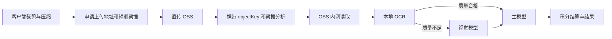

# 三端 AI 调用提速与本地知识库技术设计

## 1. 设计概述

本次把知识库从服务端检索能力降级为三端本地文件管理，同时压缩截图分析链路中的重复鉴权、公网 OSS 回读和不必要的视觉模型调用。



知识库不进入上述链路。三端只在应用私有目录维护文件副本和元数据。

## 2. 模块边界

### 2.1 Windows 与 macOS Electron

新增 `LocalKnowledgeStore`，运行在 Electron 主进程：

- 使用系统文件选择器选择 PDF、DOCX、TXT、Markdown、CSV、JSON。
- 单文件上限保持 4 MB，列表最多 200 项。
- 将文件复制到 `app.getPath("userData")/knowledge/<account-scope>/`。
- `account-scope` 使用规范化账号标识的 SHA-256，不在目录名暴露邮箱。
- 采用临时文件加原子重命名维护 `index.json`。
- IPC 只暴露 `choose/add/list/delete` 四类最小能力，不向渲染进程暴露任意文件系统路径。
- Windows 和 macOS 使用相同接口与数据结构；由于当前是两份镜像工程，实施时保持对应文件内容一致并增加一致性测试。

设置页保留/补齐“本地知识库”区域，显示文件名、类型、大小、添加时间和删除操作，并明确标注“仅保存在本机，不参与 AI 分析”。

`ProcessingHelper` 调整：

- 进入分析后立即发送处理状态。
- 删除作为必经步骤的 `checkCredits()` 调用。
- 每次用户操作生成稳定 `requestId`，同一次重试复用该值。
- 上传请求接收 `uploadTicket`；分析请求提交 `objectKey`、`uploadTicket`、`requestId`，不再提交 `screenshotUrl`。
- 继续使用现有 JPEG 压缩器，最长边 1600，质量优先 78/70，目标 150～380 KB；超过上限才继续降级。
- 客户端记录脱敏的压缩、签名、上传和分析总耗时。

### 2.2 Android

新增应用私有的 `LocalKnowledgeStore`：

- 使用 Storage Access Framework 选择文件，不新增广泛存储权限。
- 立即把所选内容复制到 `filesDir/knowledge/<account-scope>/`，不长期依赖外部 `content://` 权限。
- 使用本地 JSON 索引保存元数据，按当前账号隔离展示。
- `MainActivity` 保留/补齐本地知识库入口、列表和删除动作，文案与桌面端一致。

截图与分析调整：

- 优先沿用区域/有效页面范围；最长边 1600。
- JPEG 初始质量调整到 78，按体积逐级下降但不低于现有安全下限。
- 删除强制的客户端积分预查；由分析接口返回余额不足。
- 上传后传递 `objectKey`、`uploadTicket` 和稳定 `requestId`。
- Android 无障碍服务已获得且长度足够的 `pageText` 只作为题目文字路径直接分析；不得拼接本地知识库内容。涉及图表或页面文字不足时继续走截图链路。

### 2.3 阿里云统一入口

上传票据：

- `createScreenshotUpload` 完成一次账户验证后，返回上传地址、`objectKey` 和 5 分钟有效的 HMAC `uploadTicket`。
- 票据绑定 `objectKey`、账户令牌摘要、过期时间和随机数，不包含原始令牌。
- 新客户端分析时校验票据即可进入图片识别，省去网关再次调用 `getAccountProfile`。
- 旧客户端没有票据时继续使用原 `screenshotUrl + validateAccount` 路径，保证兼容。
- 新增生产环境秘密 `UPLOAD_TICKET_SECRET`，只存在服务器受限环境文件中。

OSS：

- 签发客户端 PUT 地址继续使用公网 OSS 客户端。
- 网关读取时使用 `ali-oss` 内网客户端和受校验的 `objectKey`。
- `objectKey` 必须位于配置前缀下、扩展名合法且通过上传票据绑定。
- 不把内网地址、RAM 临时凭据或签名 URL返回给模型和日志。

OCR 路由：

- Tesseract 改为 TSV 输出，以字符数和有效字符置信度判断质量。
- 默认接受条件：有效文字不少于 30 个字符，非空词平均置信度不低于 65；阈值做成环境配置。
- 达标时直接把 OCR 文本交给主 API。
- 不达标、进程错误或超时只回退一次 MiniMax VLM。
- 视觉回退失败后返回失败，不扣积分，不重复调用。

### 2.4 阿里云主 API

分析链路：

- 删除 `findKnowledge` 数据库查询。
- `runAnalysisModel` 不再接收或拼接 `knowledgeHits`。
- 成功响应固定返回 `usedKnowledge: false`、`knowledgeHits: []`。
- 使用日志中的 `used_knowledge` 固定写入 `false`，旧字段保留以避免数据库迁移。
- 保持账户鉴权、幂等预留、模型成功后结算、失败不扣分逻辑不变。

知识库兼容动作：

- `uploadKnowledge`：完成原有账号/序列号鉴权后返回一个内存生成的兼容文档描述，不解析正文、不写数据库。
- `listKnowledge`：鉴权后返回 `{ items: [] }`。
- `deleteKnowledge`：鉴权和参数校验后返回 `{ deleted: true }`，不写数据库。
- 管理端列表返回空分页，删除返回兼容成功；仍要求管理员鉴权。
- 旧表、历史记录和依赖包暂不删除，作为生产回滚边界。

## 3. 接口变化

### 3.1 `createScreenshotUpload` 新增响应字段

```json
{
  "objectKey": "screenshots/...jpg",
  "uploadUrl": "https://...",
  "uploadTicket": "v1.payload.signature",
  "method": "PUT",
  "headers": { "Content-Type": "image/jpeg" },
  "expiresAt": "..."
}
```

保留 `screenshotUrl` 一段兼容期，旧客户端继续可用；新客户端不使用它。

### 3.2 `analyze` 新客户端字段

```json
{
  "action": "analyze",
  "accountToken": "<redacted>",
  "requestId": "client-generated-id",
  "objectKey": "screenshots/...jpg",
  "uploadTicket": "v1.payload.signature",
  "source": "screen"
}
```

旧的 `screenshotUrl` 和 base64 输入在兼容期继续支持。

## 4. 性能与日志设计

- 网关使用单一 `requestId` 记录：`auth_ms`、`oss_read_ms`、`ocr_ms`、`vision_ms`、`upstream_ms`、`total_ms`。
- 主 API 记录：`auth_ms`、`model_ms`、`settlement_ms`、`total_ms`。
- 客户端记录：`compress_ms`、`ticket_ms`、`upload_ms`、`analyze_ms`、图片字节数。
- 生产日志只记录阶段、毫秒、状态码、图片大小和请求编号，不记录内容与秘密。
- 测试使用固定脱敏题图分别覆盖 OCR 命中、视觉回退和失败不扣分。

## 5. 安全设计

- HMAC 使用 SHA-256 和恒定时间比较，票据超过 5 分钟立即拒绝。
- `objectKey` 不接受绝对 URL、路径跳转或非截图前缀。
- 本地知识库文件名规范化，复制目标由程序生成 UUID，阻止路径穿越和覆盖。
- 本地列表不返回完整绝对路径给 UI；删除只能按本地 ID 删除受管目录内文件。
- 新客户端仍传账户令牌给最终主 API，服务端仍是账户状态和积分的唯一权威。

## 6. 测试设计

### 自动化

- 网关：票据签发/过期/篡改/对象不匹配、内网读取、OCR 达标不调用 VLM、OCR 不达标仅回退一次、旧 URL 兼容。
- 主 API：分析零知识查询、兼容字段固定、知识动作零写入、幂等扣分与失败不扣分。
- Electron：本地添加/恢复/账号隔离/删除/路径安全、无知识网络请求、图片压缩边界、请求字段。
- Android：本地文件复制/索引/账号隔离/删除、压缩边界、请求字段和无知识网络请求。
- 构建：Windows/macOS TypeScript 与生产构建、Android Gradle 构建、共享后端测试和浏览器插件兼容扫描。

### 手工/真实平台

- Windows 10/11：区域截图、全屏截图、取消、断网、积分不足和本地知识库重启恢复。
- Android 真机：文件选择器、应用重启、权限拒绝、截图和无障碍文字路径。
- macOS 真机：文件选择器沙箱、屏幕录制权限、x64/arm64、签名、公证和启动。

## 7. 生产部署设计

按“后端兼容版本 → 三端产物 → 官网下载”的顺序发布：

1. 记录当前服务状态、版本、配置键名、程序目录和公开产物 SHA-256；备份网关、主 API、Nginx 配置和数据库。
2. 在独立 release 目录上传新后端，生产依赖安装后先运行测试和本机端口冒烟。
3. 配置新的 `UPLOAD_TICKET_SECRET`，原子切换 release，依次重启主 API 与网关；失败立即恢复上一 release。
4. 验证 `/health`、旧客户端协议、新票据协议、知识库空实现、积分不足和失败不扣分。
5. 生成 Windows、Android 和 macOS 产物，记录版本/大小/SHA-256；macOS 未通过真实 Mac 签名公证前标记阻塞。
6. 备份官网 `downloads/` 上一稳定文件，上传新产物后从公网重新下载并核对哈希。
7. 执行 P0、受影响 P1、兼容和回滚抽查；全部通过后才记录可发布结论。

生产部署会修改线上服务和正式下载文件，但不会清理历史知识库数据或修改支付、账号余额和模型密钥。

## 8. 回滚设计

- 后端：恢复上一 release 目录和原环境文件，重启两个 systemd 服务，执行旧协议冒烟。
- 客户端下载：恢复备份的 Windows EXE、macOS ZIP、Android APK，并核对旧哈希。
- 本地知识库：旧客户端忽略新增目录；不自动删除用户本地文件。
- 数据库：本次无 schema 迁移，历史知识库数据不变；无需数据反向迁移。
- 回滚后重新验证登录、截图分析、成功一次扣分、失败不扣分和浏览器插件兼容。
