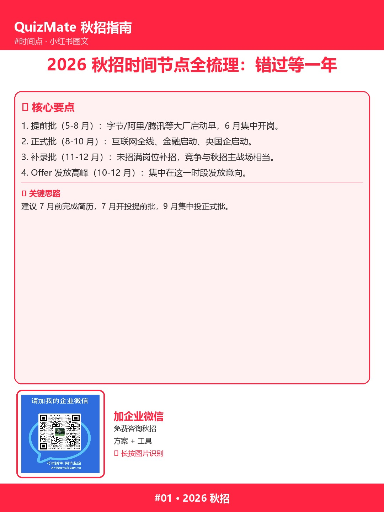

# 秋招流程监控：分散招聘信息这样管

📌 **30 秒看懂这篇**：

秋招信息分散在 5-6 个平台，每天切换到眼花？

×，不行，全靠人工盯——错过公告是常态。

×，不行，Excel 表格——只适合小批量，分散信息管不过来。

那到底怎么办？🤔

**这里有解决方案**——而且不止一种。

📋 **核心要点速记**：

1. 招聘信息分散在：企业官网、招聘公众号、就业网站、BOSS 等平台。
2. 人工监控的痛点：错过截止日、漏掉新岗位、重复看同一岗位。
3. 监控的关键能力：来源汇总、关键词匹配、新增提醒、截止预警。
4. 招聘流程监控工具的解决路径：把多来源接入，自动发现新增与截止变化。

💡 **一个关键思路**：用招聘流程监控工具建一张岗位监控清单，每天看一眼新增即可。

👆 想更系统的解法？

这里有解决方案，而且不止一种。

想看具体怎么操作，看我主页简介有官网链接。

---

📱 长按上方图片识别二维码，加企业微信咨询

---

> 完整内容：https://www.quizmate.vip/
