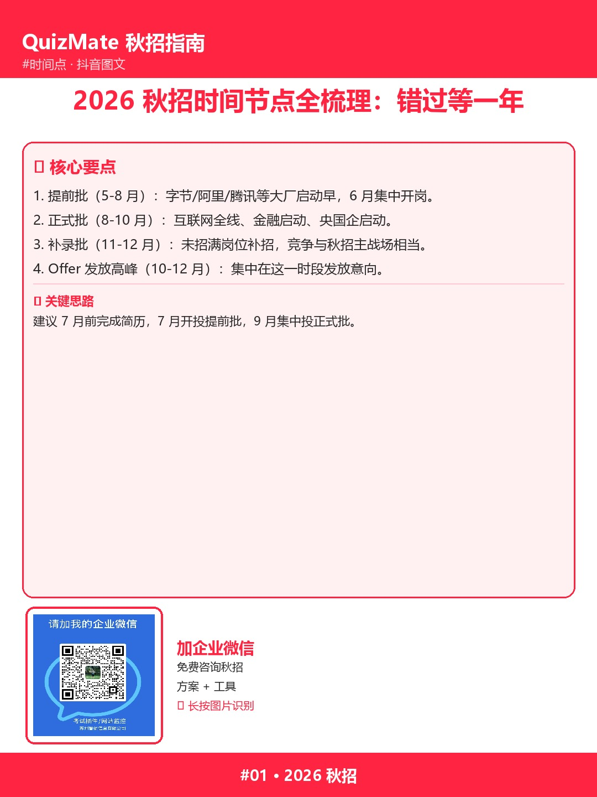

# 【抖音脚本】秋招节点错过再等一年

> ⏱ 时长：约 60 秒 ｜ 形式：口播 + 字幕

> 📱 长按上方图片识别二维码，加企业微信咨询

## 【场景】

- 出镜：求职博主 / 表情自然 / 简洁背景
- 设备：手机 + 三脚架 + 补光灯

## 【镜头 1 - 开场 3 秒】

口播：「同学，秋招时间点听过吗？」

切镜头，文字：「一文说清」

## 【镜头 2 - 二维码引导 5 秒】

口播：「想看完整版？长按识别下方二维码，加企业微信咨询」

## 【主体 - 30 秒】

口播：「今天讲：秋招时间点错过再等一年」

**第 1 个要点**：秋招只有 2 个月窗口期（9-10 月），不能等。

**第 2 个要点**：提前批截止后不会再补招，错过就真错过了。

**第 3 个要点**：正式批简历冻结期 2-4 周，修改后无法重投。

**第 4 个要点**：补录批机会少，且集中度不如正式批。

**第 5 个要点**：建立个人秋招日历：把每个企业的时间点都标注好。

## 【结尾 - 8 秒】

「想深度了解这套方法，看主页简介有官网链接，一对一咨询。」

（配合指向二维码画面）

## 【字幕/标题】

**秋招节点错过再等一年**  #秋招 #求职 #干货

## 【运营备注】

- 时长控制在 60 秒内
- 二维码放视频下方购买/评论区置顶
- 引导关注 + 私信关键词「秋招」

---

> 完整内容：https://www.quizmate.vip/
